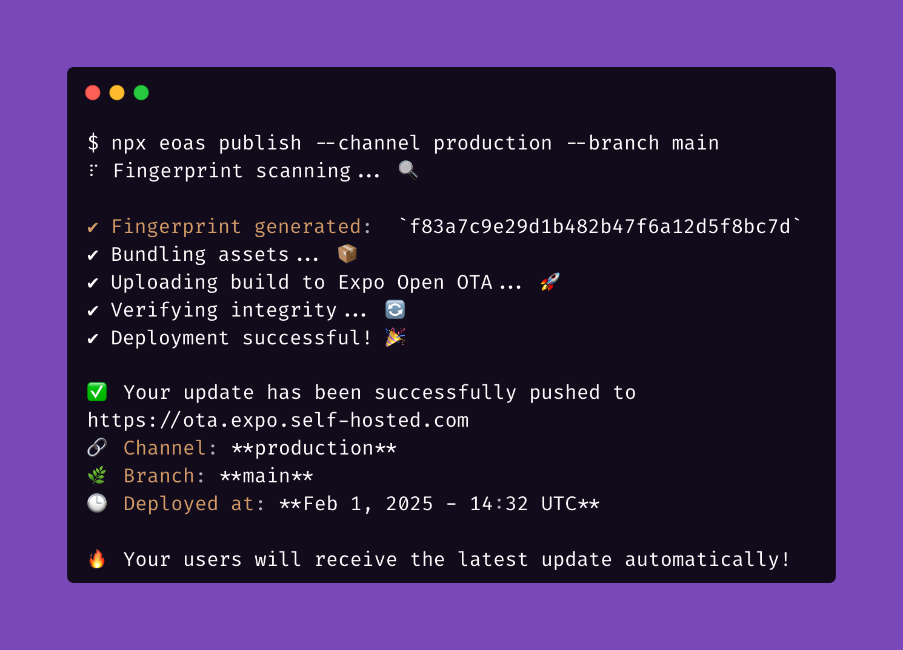

# Ariel OTA



🚀 **A fully autonomous over-the-air update server for React Native apps made by Arietta AB. Ariel OTA is capable of running completely without Expo EAS while maintaining compatibility with the Expo Updates protocol.**

## 📝 About

Ariel OTA is developed and maintained by [Arietta AB](https://meet-ariel.com). This project is forked from [axelmarciano's expo-open-ota](https://github.com/axelmarciano/expo-open-ota).

## ⚠️ Disclaimer

**Ariel OTA is not officially supported or affiliated with [Expo](https://expo.dev/).**  
This is an independent project by Arietta AB.

## 📖 Documentation

The full documentation is available at:  
➡️ [Documentation](https://help.meet-ariel.com//)

## 🛠 Features

- **Self-hosted OTA update server** for React Native applications.
- **Completely independent** from Expo EAS services.
- **Cloud storage support**: Firebase, AWS S3, local storage, and more.
- **CDN integration**: Optimized for CloudFront and other CDN providers.
- **Secure key management**: Supports Firebase authication, AWS Secrets Manager and environment-based key storage.
- **Production-ready**: Designed for scalability and performance.
- **Build and Runtime**: Ariel OTA have custom flags to handle builds and runtime without Expo ETA

## 📜 License

This project is licensed under the MIT License - see the [LICENSE](./LICENSE.md) file for details.

## Development

### Rebuild the eoas CLI locally for updates publishing

```
cd eoas && npm run build
```

### Install eoas CLI globally

To use the eoas CLI from anywhere on your computer, install it globally:

```
npm install -g ./eoas
```

Alternatively, you can link your local development version:

```
cd eoas && npm link
```

After installation, you can run `eoas` commands from any directory.